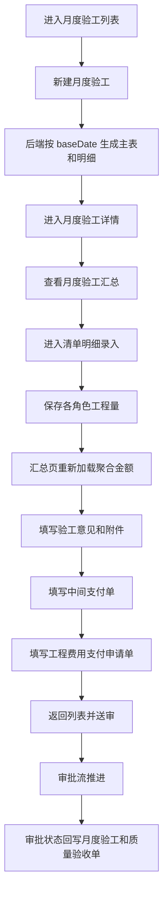
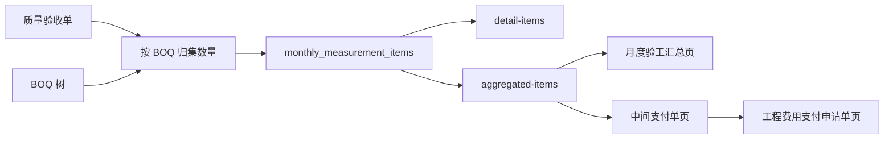

# 月度验工流程梳理

## 1. 范围说明

本文梳理的是项目工作台下“验工计价 > 月度验工”这一整套流程，覆盖以下内容：

- 前端页面入口、路由结构、页面职责
- 用户从新建月度验工到送审、审批、查看详情的完整操作链路
- 月度验工明细、验工汇总、中间支付单、工程费用支付申请单之间的数据关系
- 后端 REST 接口、审批流回写逻辑、关键数据表
- 关键权限控制和状态流转

本次梳理聚焦代码现状，不包含需求层面的理想流程设计。

## 2. 目录与关键文件

### 2.1 前端页面

- 侧边栏入口：`packages/frontend-2/components/projects/Sidebar.vue`
- 月度验工路由壳页：`packages/frontend-2/pages/projects/[id]/work-valuation/monthly-measurement.vue`
- 月度验工列表页路由：`packages/frontend-2/pages/projects/[id]/work-valuation/monthly-measurement/index.vue`
- 月度验工列表核心组件：`packages/frontend-2/components/projects/work-valuation/monthly-measurementPage.vue`
- 月度验工详情父页：`packages/frontend-2/pages/projects/[id]/work-valuation/monthly-measurement/[measurementId].vue`
- 月度验工详情默认重定向：`packages/frontend-2/pages/projects/[id]/work-valuation/monthly-measurement/[measurementId]/index.vue`
- 月度验工汇总页：`packages/frontend-2/pages/projects/[id]/work-valuation/monthly-measurement/[measurementId]/acceptance.vue`
- 清单明细录入页：`packages/frontend-2/pages/projects/[id]/work-valuation/monthly-measurement/[measurementId]/acceptance-edit.vue`
- 中间支付单页：`packages/frontend-2/pages/projects/[id]/work-valuation/monthly-measurement/[measurementId]/payment-details.vue`
- 工程费用支付申请单页：`packages/frontend-2/pages/projects/[id]/work-valuation/monthly-measurement/[measurementId]/payment-requests.vue`

### 2.2 后端核心

- REST 路由与权限控制：`packages/server/modules/quality-acceptance-form/rest/router.ts`
- 月度验工预览与创建服务：`packages/server/modules/quality-acceptance-form/services/monthlyMeasurements.ts`
- 审批流状态回写：`packages/server/modules/flow/services/approvalFlows.ts`

## 3. 页面结构与路由

### 3.1 路由树

```text
/projects/:projectId/work-valuation/monthly-measurement
├── index                         月度验工列表
└── :measurementId
    ├── index                     默认跳转到 /acceptance
    ├── acceptance                月度验工汇总页
    ├── acceptance-edit           清单明细录入页
    ├── payment-details           中间支付单
    └── payment-requests          工程费用支付申请单
```

### 3.2 页面职责

#### 列表页

列表页负责：

- 查询月度验工单分页列表
- 支持搜索、分页
- 新增月度验工单
- 编辑草稿态月度验工单
- 删除草稿态月度验工单
- 送审
- 查看审批流详情
- 进入详情页

#### 详情父页

详情父页负责：

- 根据 `measurementId` 拉取主表信息
- 维护顶部页签
- 向子页透传当前月度验工主单数据
- 子页保存后通过 `refetch` 回刷主表

#### 详情子页

- `acceptance.vue`：展示按章节聚合后的验工金额，并维护监理、指挥部、投资监理、业主的签署意见和附件
- `acceptance-edit.vue`：按 BOQ 树录入或调整各角色的工程量
- `payment-details.vue`：基于聚合结果填写中间支付单
- `payment-requests.vue`：填写工程费用支付申请单及多角色意见

## 4. 整体业务主线

从代码看，月度验工的核心业务主线如下：

1. 在列表页新建月度验工单
2. 后端根据 `baseDate` 自动汇总质量验收单，生成月度验工主表和明细表
3. 进入详情页查看“月度验工”汇总
4. 如有需要，从汇总页进入“清单明细录入”页，填写施工/监理/指挥部/投资监理数量
5. 汇总页按聚合接口展示章节金额和累计金额，并填写各方验工意见
6. 切换到“中间支付单”页，填写支付相关信息
7. 切换到“工程费用支付申请单”页，填写申请金额和多方意见
8. 回到列表页点击“送审”
9. 审批流驱动当前可编辑角色变化，并把审批结果回写到月度验工主表
10. 审批最终状态再同步回写到关联的质量验收单

## 5. 新建与编辑流程

### 5.1 前端入口

列表页组件 `monthly-measurementPage.vue` 负责新建和编辑弹窗。

表单字段主要有：

- `roundName`：期数
- `baseDate`：年月
- `startDate`：计量开始日期
- `endDate`：计量结束日期
- `unit`：施工单位或标段相关字段

其中 `baseDate` 改变后，前端会自动把计量时间段联动为：

- 开始日期：上个月 19 日
- 结束日期：本月 20 日

### 5.2 创建逻辑

前端提交到：

- `POST /api/v1/projects/:projectId/monthly-measurements`

后端创建时会做这些事：

1. 生成编码，格式为 `YG-YYYY-XXX`
2. 根据 `baseDate` 构建月度验工预览
3. 从质量验收单中汇总可纳入本次月度验工的工程量
4. 生成月度验工主表记录
5. 生成月度验工明细表记录
6. 补充 `roundName/startDate/endDate/contractCode`

### 5.3 编辑逻辑

前端提交到：

- `PUT /api/v1/projects/:projectId/monthly-measurements/:id`

编辑仅允许草稿态，即：

- `approveStatus` 为空
- 或 `approveStatus === 'START'`

如果已经送审，后端直接拒绝编辑。

编辑时分两种情况：

#### 1. `baseDate` 未变化

后端沿用当前已有明细，仅按前端传入的排除项和手工输入重建记录。

#### 2. `baseDate` 变化

后端重新执行预览逻辑，重新计算应纳入的质量验收单及 BOQ 明细，再重建月度验工明细。

## 6. 月度验工预览是如何生成的

月度验工预览生成逻辑在：

- `services/monthlyMeasurements.ts`

### 6.1 数据来源

预览构建时会读取三类数据：

- `baseDate` 之前的质量验收单
- 手动固定的质量验收单 `pinnedAcceptanceIds`
- 项目 BOQ 清单

### 6.2 聚合规则

后端会按 BOQ 项归集质量验收单数据，区分两类数量：

- `pendingMeasuredQty`：待纳入本次月度验工的量
- `approvedCumulativeQty`：历史已审批通过的累计量

同时记录：

- `sourceAcceptanceIds`
- `sourceAcceptances`

这意味着月度验工与质量验收单之间不是简单的一对一关系，而是“按 BOQ 归集后的多对多映射”。

### 6.3 树结构处理

BOQ 如果存在父子结构，后端会：

- 先把叶子节点数量按来源归集
- 再自底向上汇总父节点
- 父节点标记为 `isSummaryRow`
- 最终按树的顺序生成 `sortIndex`

因此，月度验工明细天然带有树形层级。

## 7. 列表页流程

### 7.1 列表查询

前端调用：

- `GET /api/v1/projects/:projectId/monthly-measurements`

列表页返回的不只是主表字段，还会额外补充：

- 创建人信息
- 当前验工总额
- 当前审批负责人

其中验工总额的计算口径是：

- `monthly_measurement_items` 中非汇总行
- `investmentQty * price` 之和

### 7.2 操作按钮能力

列表页上的核心操作有：

- 查看详情
- 编辑
- 删除
- 送审
- 查看审批流详情

操作限制：

- 已送审数据不可编辑
- 已送审数据不可删除
- 送审后状态进入 `PENDING`

### 7.3 送审流程

前端调用：

- `POST /api/v1/projects/:projectId/monthly-measurements/:id/submit`

后端会：

1. 校验当前单据尚未送审
2. 查找 `MONTHLY_INSPECTION` 类别下的启用审批流
3. 启动审批实例
4. 将主表更新为：
   - `flowInstanceId = instance.id`
   - `approveStatus = 'PENDING'`
   - `updatedAt = new Date()`

## 8. 详情页流程

### 8.1 父页加载

详情父页通过：

- `GET /api/v1/projects/:projectId/monthly-measurements/:measurementId`

拉取月度验工主表，并得到：

- 主表基础信息
- `currentStepName`
- `currentStepApprovers`

子页面的权限判断，主要依赖这两个字段。

### 8.2 默认打开“月度验工”

详情页默认会重定向到：

- `/acceptance`

说明代码中的默认工作面是“月度验工汇总页”，而不是支付页。

## 9. 月度验工汇总页

对应页面：

- `acceptance.vue`

### 9.1 页面职责

该页承担两块职责：

1. 按章节展示月度验工金额汇总
2. 填写验工意见、签署人、签署时间、附件

### 9.2 核心数据加载

页面会并行关注两类数据：

#### 1. 聚合金额数据

调用接口：

- `GET /api/v1/projects/:projectId/monthly-measurements/:id/aggregated-items`

该接口返回按分类工程聚合后的金额信息，包括：

- `contractAmount`
- `contractorAmount`
- `supervisionAmount`
- `headquartersAmount`
- `investmentAmount`
- `yearlyAmount`
- `cumulativeAmount`
- `cumulativeRate`

#### 2. Tab1 意见数据

调用接口：

- `GET /api/v1/projects/:projectId/monthly-measurements/:id/acceptance`

用于加载：

- 监理意见
- 指挥部意见
- 投资监理意见
- 业主意见
- 对应签署人
- 对应日期
- 附件

### 9.3 明细录入入口

在汇总页可以跳转到：

- `/acceptance-edit`

还可以通过 query 携带：

- `boqItemId`
- `boqName`

表示只编辑某个章节子树。

### 9.4 模型查看

汇总页会基于聚合结果中的 `sourceAcceptanceIds`，反查质量验收单上的 BIM 信息，然后组装：

- `modelId`
- `bimIds`
- `applicationIds`

供模型查看器使用。

这说明“月度验工汇总页”并不是纯表单页，它还承担了从月度验工追溯到质量验收和 BIM 模型的关联查看能力。

### 9.5 保存逻辑

保存调用：

- `PATCH /api/v1/projects/:projectId/monthly-measurements/:id/acceptance`

后端不会一次性无差别保存所有字段，而是按角色拆分校验：

- `supervision*` 由监理节点可写
- `headquarters*` 由指挥部节点可写
- `investment*` 由投资监理节点可写
- `owner*` 由业主或归档节点可写

附件字段 `acceptanceAttachments` 也会保存到该副表中。

## 10. 清单明细录入页

对应页面：

- `acceptance-edit.vue`

### 10.1 页面职责

该页面是整套流程里最关键的数据录入页，负责按 BOQ 树录入不同角色的工程量。

### 10.2 数据加载

调用接口：

- `GET /api/v1/projects/:projectId/monthly-measurements/:id/detail-items`

后端除了返回当前月度验工明细外，还会额外计算：

- `lastCumulativeQty`：历史已审批通过的累计投资监理核定量
- `yearlyCumulativeQty`：本年度已审批通过累计量

这两个字段只读，用于辅助本次填报。

### 10.3 页面内处理

前端会：

- 支持整棵 BOQ 树展开/折叠
- 根据 query 限制只展示某章节子树
- 在本地执行自底向上的汇总计算
- 汇总行不直接保存，只保存叶子/非汇总行

### 10.4 保存逻辑

调用接口：

- `PATCH /api/v1/projects/:projectId/monthly-measurements/:id/detail-items`

前端当前提交的是：

- `contractorQty`
- `supervisionQty`
- `headquartersQty`
- `investmentQty`

后端根据提交字段自动判断本次写入需要的角色权限。

保存成功后：

- 返回 `acceptance` 页
- 汇总页重新查询 `aggregated-items`
- 章节金额随之更新

## 11. 聚合金额是如何算出来的

月度验工汇总页和中间支付单页都依赖：

- `GET /api/v1/projects/:projectId/monthly-measurements/:id/aggregated-items`

### 11.1 输入数据

该接口会综合：

- 当前月度验工明细 `monthly_measurement_items`
- 历史已审批通过月度验工明细
- BOQ 结构信息

### 11.2 计算逻辑

对叶子节点：

- 合同金额 = `pendingTotalQty * price`
- 施工申报金额 = `contractorQty * price`
- 监理审定金额 = `supervisionQty * price`
- 指挥部审定金额 = `headquartersQty * price`
- 投资监理核定金额 = `investmentQty * price`

对父节点：

- 递归累加子节点金额

累计值：

- `historyCumulative` = 历史已通过月度验工的投资监理核定金额累计
- `historyYearly` = 当前年份内历史已通过月度验工的投资监理核定金额累计
- `cumulativeAmount = historyCumulative + investmentAmount`
- `yearlyAmount = historyYearly + investmentAmount`

输出层级：

- 若 BOQ 中存在 `CATEGORY` 类型，则只输出分类工程级别
- 否则输出顶层节点

## 12. 中间支付单页

对应页面：

- `payment-details.vue`

### 12.1 页面定位

该页以聚合金额为基础，补充支付信息，形成中间支付单。

### 12.2 依赖数据

页面会加载两部分：

1. `aggregated-items`
2. `payment-details`

其中 `aggregated-items` 提供各章节金额和支付金额汇总基础，`payment-details` 提供表单侧字段。

### 12.3 表单字段

主要字段有：

- `interimPayProgress`
- `migrantWorkerSalary`
- `interimRemark`
- `contractorSign`
- `supervisionSign`
- `preparerSign`
- `paymentAttachments`

### 12.4 保存逻辑

调用接口：

- `PATCH /api/v1/projects/:projectId/monthly-measurements/:id/payment-details`

后端按角色约束字段：

- `contractorSign`：草稿期施工单位填写
- `supervisionSign`：监理步骤填写
- `interimPayProgress/migrantWorkerSalary/preparerSign`：投资监理步骤填写

投资监理写入这些字段时，后端会顺带更新：

- `interimSignDate`

## 13. 工程费用支付申请单页

对应页面：

- `payment-requests.vue`

### 13.1 页面定位

该页承接支付申请信息，覆盖更完整的多角色意见链。

### 13.2 数据加载

调用接口：

- `GET /api/v1/projects/:projectId/monthly-measurements/:id/payment-requests`

后端除了读取现有申请单副表，还会补充两个默认值：

- `contractAmount`
- `lastCumulativePayment`

其中：

- `contractAmount` 来自全项目 BOQ 叶子节点 `price * quantity` 汇总
- `lastCumulativePayment` 来自历史已审批通过月度支付单的 `interimPayProgress` 汇总

### 13.3 保存逻辑

调用接口：

- `PATCH /api/v1/projects/:projectId/monthly-measurements/:id/payment-requests`

支持保存：

- 各角色支付金额
- 各角色意见
- 各角色审核人
- 附件

涉及角色包括：

- contractor
- supervision
- headquarters
- investment
- contract
- leader

后端会按当前审批节点校验谁可以写哪一组字段，并自动写入对应日期字段。

### 13.4 页面附加能力

页面里还有两个辅助功能：

- `window.print()` 打印
- “生成并导出验工计价封面”的提示占位

目前从代码看，“封面导出”还只是提示，没有真实导出实现。

## 14. 权限控制

整套流程的权限判断核心在后端 `checkWritePermission`。

### 14.1 草稿期

如果：

- `approveStatus` 为空
- 或 `approveStatus === 'START'`

则视为草稿期。

草稿期只有：

- `contractor`

可以写数据。

### 14.2 审批期

如果已经进入审批流，则后端会：

1. 找到当前 `pending` 的审批步骤
2. 校验当前用户是否在该步骤审批人列表内
3. 根据步骤名称判断允许写入的角色

角色与步骤名的对应关系是：

- 步骤名包含“监理” -> `supervision`
- 步骤名包含“指挥部” -> `headquarters`
- 步骤名包含“投资监理” -> `investment`
- 步骤名包含“合约” -> `contract`
- 步骤名包含“领导” -> `leader`
- 步骤名包含“业主”或“归档” -> `owner`

前端页面上的可编辑状态也是按同样规则做的，但真正生效的是后端校验。

## 15. 状态流转

### 15.1 月度验工主状态

前端映射的状态如下：

- `START`：待送审
- `PENDING`：审批中
- `APPROVED`：已通过
- `REJECTED`：已驳回
- `CANCELED`：已取消

### 15.2 状态变化来源

#### 列表页送审

把单据从草稿推进到：

- `PENDING`

#### 审批流回写

审批流状态变化后，会通过 `approvalFlows.ts` 把审批结果映射回：

- `monthly_measurements.approveStatus`

### 15.3 对质量验收单的反向影响

审批流回写月度验工状态后，还会：

1. 找出当前月度验工明细引用到的全部 `sourceAcceptanceIds`
2. 把这些质量验收单的 `approveStatus` 同步更新成相同状态

也就是说，月度验工审批结果会反向影响被纳入的质量验收单审批状态。

## 16. 数据模型关系

从代码使用上看，至少涉及以下几张核心表：

- `monthly_measurements`：月度验工主表
- `monthly_measurement_items`：月度验工明细表
- `monthly_measurement_details`：月度验工意见与附件
- `monthly_payment_details`：中间支付单
- `monthly_payment_requests`：工程费用支付申请单
- `approval_flow_instance_steps`：审批流当前步骤

可以概括为：

```text
quality_acceptance_forms
        │
        │ 按 BOQ / baseDate 归集
        ▼
monthly_measurements
        │
        ├── monthly_measurement_items
        ├── monthly_measurement_details
        ├── monthly_payment_details
        └── monthly_payment_requests
```

其中：

- 主表控制流程状态、审批实例、基础信息
- 明细表承载 BOQ 树和各角色数量
- 三个副表分别承载汇总意见、支付单、支付申请单

## 17. 端到端时序

### 17.1 用户操作视角



### 17.2 数据计算视角



## 18. 现状结论

### 18.1 这个模块的真实核心

虽然页面上分成“月度验工 / 中间支付单 / 工程费用支付申请单”三个页签，但真正的核心是：

- 月度验工主表
- 月度验工明细表
- 聚合金额接口 `aggregated-items`
- 审批流驱动的多角色分段填报

后两个页签本质上是建立在月度验工明细和聚合金额之上的派生单据。

### 18.2 代码组织特点

当前前端没有为这块业务抽独立 store 或 composable，主要特点是：

- 状态集中在页面组件内部
- 页面之间通过父页 `item` 和 `refetch` 协作
- REST 接口承担了大部分业务编排
- 审批流与业务表回写耦合较深

### 18.3 一句话总结

“月度验工”是一个以 BOQ 树为主线、以质量验收单为来源、以审批节点驱动多角色分段填写、再衍生出汇总、支付单、支付申请单的复合流程模块。
